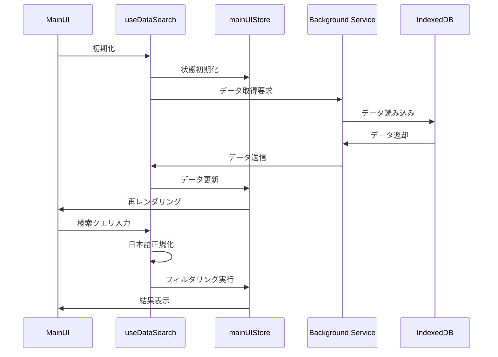
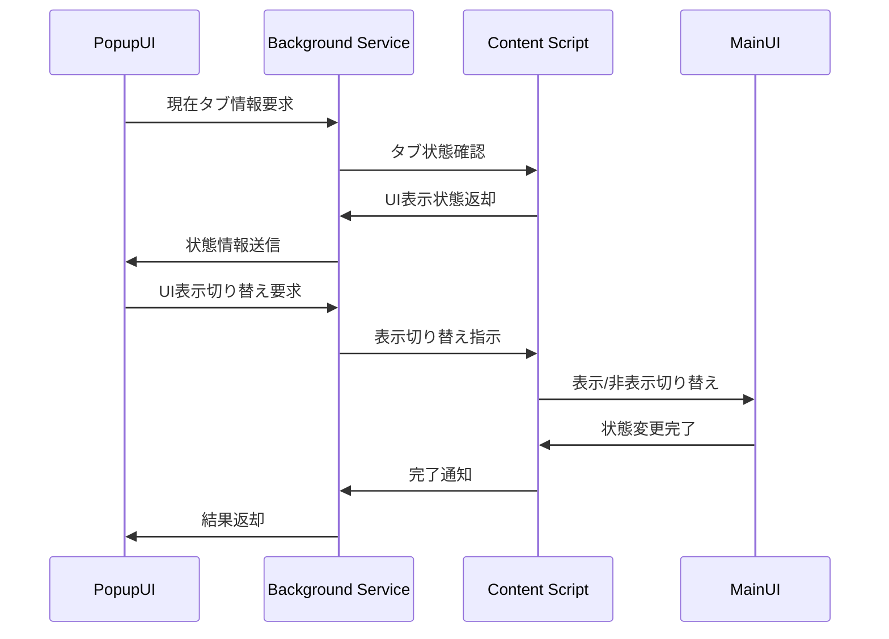
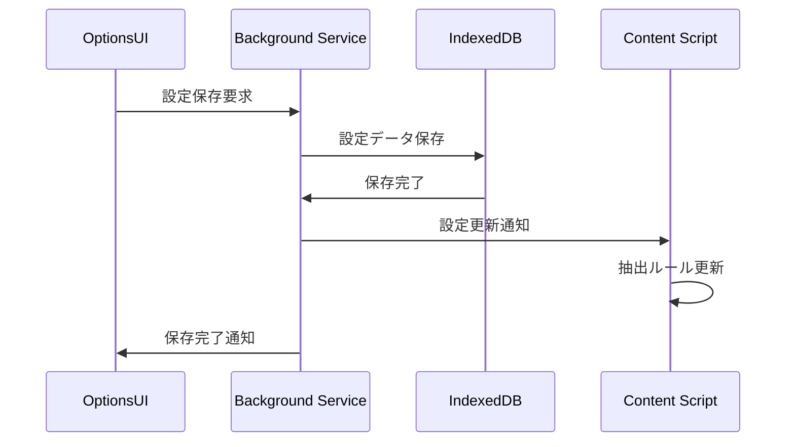

# Kansu UI完成機能 設計書

## 概要

本設計書は、Kansu拡張機能の残りUI機能（メインUI、Popup UI、Options UI、共通コンポーネント）の技術的な設計を定義します。既存のPhase 1-3（データ構造、Background Service、Content Script）の実装を基盤として、React + TypeScript + Shadcn/uiを使用したモダンなUI実装を行います。

## アーキテクチャ

### 技術スタック

- **フレームワーク**: React 19.1.0 + TypeScript
- **UIライブラリ**: Shadcn/ui (Radix UI ベース)
- **スタイリング**: Tailwind CSS 4.1.11
- **状態管理**: Zustand 5.0.6
- **データベース**: Dexie.js 4.0.11 (既存実装)
- **日本語処理**: moji.js (文字種正規化ライブラリ)
- **アイコン**: Lucide React 0.525.0
- **ビルドツール**: WXT 0.20.6

### ディレクトリ構造

```
src/
├── components/
│   ├── ui/                    # Shadcn/ui基本コンポーネント
│   │   ├── button.tsx         # 既存
│   │   ├── input.tsx          # 新規作成
│   │   ├── toast.tsx          # 新規作成
│   │   ├── modal.tsx          # 新規作成
│   │   ├── select.tsx         # 新規作成
│   │   ├── table.tsx          # 新規作成
│   │   └── pagination.tsx     # 新規作成
│   ├── main-ui/               # メインUI専用コンポーネント
│   │   ├── MainUI.tsx         # メインUIコンテナ
│   │   ├── DataTable.tsx      # データ表示テーブル
│   │   ├── SearchBar.tsx      # 検索バー
│   │   ├── FilterPanel.tsx    # フィルター・ソートパネル
│   │   └── PaginationControls.tsx # ページネーション制御
│   ├── popup/                 # Popup UI専用コンポーネント
│   │   ├── PopupUI.tsx        # Popup UIコンテナ
│   │   ├── ToggleSwitch.tsx   # メインUI表示切り替え
│   │   └── StatusDisplay.tsx  # データ件数・状態表示
│   └── options/               # Options UI専用コンポーネント
│       ├── OptionsUI.tsx      # Options UIコンテナ
│       ├── ServiceList.tsx    # サービス設定一覧
│       ├── ServiceForm.tsx    # サービス設定フォーム
│       ├── FieldEditor.tsx    # フィールド設定エディタ
│       └── DataManager.tsx    # データ管理（インポート/エクスポート）
├── hooks/                     # カスタムフック
│   ├── useMainUI.ts          # メインUI状態管理
│   ├── useDataSearch.ts      # データ検索・フィルタリング
│   ├── useServiceConfig.ts   # サービス設定管理
│   ├── useToast.ts           # Toast通知管理
│   └── useBackgroundMessage.ts # Background Service通信
├── stores/                    # Zustand状態管理
│   ├── mainUIStore.ts        # メインUI状態
│   ├── popupStore.ts         # Popup UI状態
│   ├── optionsStore.ts       # Options UI状態
│   └── toastStore.ts         # Toast通知状態
├── lib/                       # 既存ライブラリ
│   ├── utils.ts              # 既存ユーティリティ
│   ├── database.ts           # 既存データベース操作
│   ├── types.ts              # 既存型定義
│   └── japanese-normalizer.ts # 新規：moji.jsを使用した軽量日本語正規化
└── entrypoints/              # 既存エントリーポイント
    ├── content.ts            # 既存Content Script
    ├── background.ts         # 既存Background Service
    ├── popup/
    │   └── index.html        # 新規Popup UI
    └── options/
        └── index.html        # 新規Options UI
```

## コンポーネント設計

### 1. メインUI (Content Script注入)

#### 1.1 MainUI.tsx

**責務**: メインUIのコンテナコンポーネント、全体のレイアウトと状態管理

```typescript
interface MainUIProps {
  serviceName: string;
  isVisible: boolean;
  onClose: () => void;
}

interface MainUIState {
  data: ExtractedData[];
  filteredData: ExtractedData[];
  searchQuery: string;
  selectedField: string;
  sortField: string;
  sortOrder: 'asc' | 'desc';
  currentPage: number;
  itemsPerPage: number;
  isLoading: boolean;
}
```

**主要機能**:

- データの取得・表示
- 検索・フィルタリング・ソート
- ページネーション
- レスポンシブレイアウト
- ページスタイルからの分離（Shadow DOM使用検討）

#### 1.2 DataTable.tsx

**責務**: データの表形式表示

```typescript
interface DataTableProps {
  data: ExtractedData[];
  fields: Field[];
  sortField: string;
  sortOrder: 'asc' | 'desc';
  onSort: (field: string) => void;
  currentPage: number;
  itemsPerPage: number;
}
```

**主要機能**:

- 動的カラム生成（フィールド設定に基づく）
- ソート機能（ヘッダークリック）
- データ型に応じた表示（テキスト、リンク、画像）
- ページネーション対応（効率的なデータ分割表示）

#### 1.3 SearchBar.tsx

**責務**: 検索機能のUI

```typescript
interface SearchBarProps {
  searchQuery: string;
  selectedField: string;
  fields: Field[];
  onSearchChange: (query: string) => void;
  onFieldChange: (field: string) => void;
}
```

**主要機能**:

- スロットル機能付きインクリメンタル検索
- 検索対象フィールド選択
- moji.jsを使用した日本語正規化検索
- 検索履歴（オプション）

### 2. Popup UI

#### 2.1 PopupUI.tsx

**責務**: Popup UIのメインコンテナ

```typescript
interface PopupUIState {
  currentTab: chrome.tabs.Tab | null;
  isMainUIVisible: boolean;
  dataCount: number;
  isTargetSite: boolean;
  serviceName: string | null;
}
```

**主要機能**:

- 現在のタブ情報取得
- メインUI表示状態の確認・切り替え
- データ件数表示
- 対象サイト判定

#### 2.2 ToggleSwitch.tsx

**責務**: メインUI表示切り替えスイッチ

```typescript
interface ToggleSwitchProps {
  isEnabled: boolean;
  isLoading: boolean;
  onToggle: (enabled: boolean) => void;
}
```

### 3. Options UI

#### 3.1 OptionsUI.tsx

**責務**: Options UIのメインコンテナ

```typescript
interface OptionsUIState {
  services: ServiceConfig[];
  selectedService: ServiceConfig | null;
  isEditing: boolean;
  activeTab: 'services' | 'data' | 'settings';
}
```

#### 3.2 ServiceForm.tsx

**責務**: サービス設定の作成・編集フォーム

```typescript
interface ServiceFormProps {
  service: ServiceConfig | null;
  onSave: (service: ServiceConfig) => void;
  onCancel: () => void;
}

interface ServiceFormState {
  serviceName: string;
  activateUrlPatterns: string[];
  updateAreaSelector: string;
  itemSelector: string;
  uniqueKeyFieldName: string;
  fields: Field[];
  errors: Record<string, string>;
}
```

#### 3.3 FieldEditor.tsx

**責務**: フィールド設定の編集

```typescript
interface FieldEditorProps {
  fields: Field[];
  onChange: (fields: Field[]) => void;
}

interface FieldFormData {
  name: string;
  selector: string;
  type: 'text' | 'linkUrl' | 'imageUrl' | 'regex';
  regex?: string;
}
```

### 4. 共通UIコンポーネント

#### 4.1 Toast.tsx

**責務**: 通知メッセージの表示

```typescript
interface ToastProps {
  id: string;
  type: 'success' | 'error' | 'warning' | 'info';
  title: string;
  description?: string;
  duration?: number;
  onClose: (id: string) => void;
}
```

**主要機能**:

- 自動消去タイマー
- 複数Toast管理
- アニメーション（フェードイン/アウト）
- アクセシビリティ対応

#### 4.2 Modal.tsx

**責務**: モーダルダイアログの表示

```typescript
interface ModalProps {
  isOpen: boolean;
  title: string;
  children: React.ReactNode;
  onClose: () => void;
  size?: 'sm' | 'md' | 'lg' | 'xl';
}
```

**主要機能**:

- 背景オーバーレイ
- ESCキーで閉じる
- フォーカストラップ
- ポータル使用（z-index問題回避）

## データフロー設計

### 1. メインUI データフロー



### 2. Popup-Content Script 通信



### 3. Options-Background 通信



## 状態管理設計

### 1. mainUIStore.ts (Zustand)

```typescript
interface MainUIState {
  // データ状態
  data: ExtractedData[];
  filteredData: ExtractedData[];
  isLoading: boolean;
  error: string | null;

  // UI状態
  isVisible: boolean;
  searchQuery: string;
  selectedField: string;
  sortField: string;
  sortOrder: 'asc' | 'desc';
  currentPage: number;
  itemsPerPage: number;

  // アクション
  setData: (data: ExtractedData[]) => void;
  setSearchQuery: (query: string) => void;
  setSort: (field: string, order: 'asc' | 'desc') => void;
  setPage: (page: number) => void;
  toggleVisibility: () => void;
  filterData: () => void;
}
```

### 2. toastStore.ts (Zustand)

```typescript
interface ToastState {
  toasts: Toast[];
  addToast: (toast: Omit<Toast, 'id'>) => void;
  removeToast: (id: string) => void;
  clearAll: () => void;
}
```

## エラーハンドリング設計

### 1. エラー分類

- **ネットワークエラー**: Background Service通信失敗
- **データエラー**: データベース操作失敗
- **バリデーションエラー**: フォーム入力検証失敗
- **システムエラー**: 予期しない例外

### 2. エラー表示戦略

```typescript
interface ErrorHandlingStrategy {
  // Toast通知で表示
  showToastError: (error: Error, context: string) => void;
  
  // インライン表示（フォーム等）
  showInlineError: (field: string, message: string) => void;
  
  // フォールバック表示
  showFallbackUI: (error: Error) => void;
}
```

## パフォーマンス最適化

### 1. メインUI最適化

- **ページネーション**: 効率的なページ分割による大量データ表示最適化
- **スロットル検索**: インクリメンタル検索での適度な頻度制限による性能向上
- **メモ化**: React.memo、useMemo、useCallbackの適切な使用
- **遅延ローディング**: 初期表示時の必要最小限データ読み込み

### 2. データ処理最適化

```typescript
// moji.jsを使用した軽量な日本語正規化
import Moji from 'moji';

class JapaneseNormalizer {
  static normalize(text: string): string {
    return Moji(text)
      .convert('ZE', 'HE') // 全角英数字 → 半角英数字
      .convert('ZS', 'HS') // 全角スペース → 半角スペース
      .convert('HG', 'KK') // ひらがな → カタカナ
      .toString();
  }
}
```

## アクセシビリティ設計

### 1. キーボードナビゲーション

- **Tab順序**: 論理的なフォーカス順序
- **基本キー操作**: ESC、Enterなどの基本的なキー操作（サイト干渉回避のためショートカットキーは除外）
- **フォーカス管理**: モーダル・ドロップダウンでのフォーカストラップ

### 2. スクリーンリーダー対応

```typescript
// ARIAラベルの適切な設定
interface AccessibilityProps {
  'aria-label'?: string;
  'aria-describedby'?: string;
  'aria-expanded'?: boolean;
  'aria-selected'?: boolean;
  role?: string;
}
```

### 3. 色・コントラスト

- **高コントラスト対応**: WCAG AA基準準拠
- **色以外の情報伝達**: アイコン・テキストでの状態表示
- **ダークモード対応**: システム設定に応じた自動切り替え

## セキュリティ考慮事項

### 1. XSS対策

- **サニタイゼーション**: ユーザー入力データの適切な処理
- **CSP設定**: Content Security Policyの適切な設定
- **DOM操作**: dangerouslySetInnerHTMLの使用回避

### 2. データ保護

- **ローカルストレージ**: IndexedDBでのデータ保存（暗号化不要）
- **通信セキュリティ**: Background Service通信の検証
- **権限管理**: 最小権限の原則

## テスト戦略

### 1. ユニットテスト (Vitest)

- **コンポーネントテスト**: React Testing Library使用
- **フックテスト**: カスタムフックの動作検証
- **ユーティリティテスト**: 日本語正規化等の関数テスト

### 2. 統合テスト

- **Background Service通信**: メッセージパッシングのテスト
- **データフロー**: エンドツーエンドのデータ処理テスト

### 3. E2Eテスト (Playwright)

- **ユーザーフロー**: 主要な操作シナリオのテスト
- **ブラウザ互換性**: Chrome拡張機能としての動作確認
