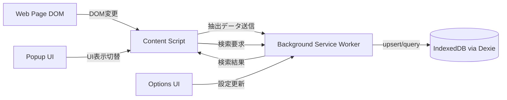
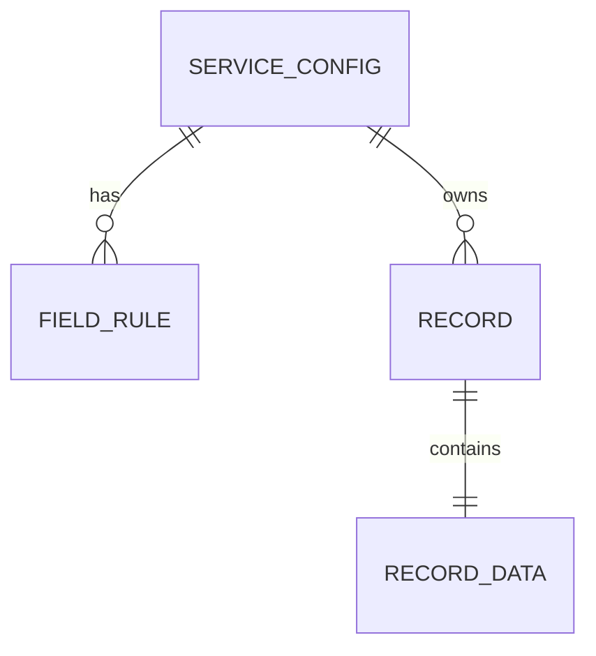

# Kansu: infinite scroll archiver 実装ガイド

## 1. このドキュメントの目的

本ドキュメントは、
[requirements.md の「4. 機能要件（MVP）」](requirements.md#4-機能要件mvp) と
[「5. 非機能要件」](requirements.md#5-非機能要件)
の要件（`FR-*`, `NFR-*`）を実装レベルに落とし込むための技術仕様です。  
実装時に迷いやすい以下を明確化します。

- Manifest V3前提の実行モデル
- データモデルとIndexedDB設計
- Content Script/Background間のメッセージ契約
- 抽出、検索、ソート、インポート/エクスポートの実装方針

### 1.1. 位置づけと読み方（重要）

- **[implementation_plan.md の「1. 基本方針」](implementation_plan.md#1-基本方針)** を補足する、やや抽象的なイメージと技術方針の束として読む。図や箇条書きは理解の助けであり、**リポジトリの唯一の正本（source of truth）ではない**。
- **実装・改修の最終判断**は、優先順位が高い順に
  [requirements.md の要件](requirements.md#4-機能要件mvp)、
  既存ソース、テスト、メッセージ型・バリデーション等の契約に従う。本書とコードや要件が食い違う場合は、**本書が古いか簡略化されている可能性**を疑う。
- 詳細な永続化スキーマの意図は
  [storage-and-db-design.md の「設計意図」](storage-and-db-design.md#設計意図)
  も参照する（本書の DB 節は概要に留まる場合がある）。

**本書だけを過信して実装に当てはめるのは避ける。** 足りない具体性はコード探索とテストで補う。

## 2. 設計原則

### 2.1. MV3前提のイベント駆動

- Service Workerは停止/再開されるため、グローバル変数を信頼しない（`NFR-10`）。
  挙動は
  [Chrome Extensions: service worker lifecycle](https://developer.chrome.com/docs/extensions/develop/concepts/service-workers/lifecycle)
  を参照。
- 復元可能な状態はIndexedDB/`chrome.storage`へ保存する
- 処理は再入可能・冪等（同一メッセージの再処理に耐える）にする

### 2.2. 最小権限・ローカル完結

- 権限は最小化し、不要な `host_permissions` を持たない（`NFR-21`）
- 抽出データはローカル保存のみで、外部送信しない（`NFR-20`）

### 2.3. 高頻度DOM変更への耐性

- `MutationObserver` コールバックでは重い処理を直接実行しない（`NFR-03`）。
  API は
  [MDN: MutationObserver](https://developer.mozilla.org/en-US/docs/Web/API/MutationObserver)
  を参照。
- 変更通知をキュー化して、抽出処理はバッチで実行する（`FR-13`）

## 3. 技術スタック

| 領域 | 採用技術 | 用途 |
| --- | --- | --- |
| 拡張基盤 | WXT + Manifest V3 | エントリーポイント管理、ビルド |
| UI | React + Tailwind CSS + Shadcn/ui | Popup/Options/メインUI |
| 状態管理 | Zustand | UI状態とフォーム状態 |
| 永続化 | Dexie (IndexedDB) | 設定・抽出データ保存 |
| 品質 | Biome + MarkdownLint | lint/format/doc規約 |
| テスト | Vitest + Playwright（UI コンポーネントの網羅に Testing Library 等を併用しうる） | 単体/統合/コンポーネント/E2E |

## 4. アーキテクチャ



### 4.1. 配置とルーティング前提

- プロジェクトのソースコードは `src` 配下に集約する
- WXTのファイルベース構成に従い、エントリーポイントを責務単位で分離する
  - `src/entrypoints/content/` … Content Script（エントリは `index.ts`。補助モジュールは同ディレクトリにコロケート。WXT では `content.ts` と `content/index.ts` を**併存させない**）
  - `src/entrypoints/background.ts` … Background（Service Worker）
  - `src/entrypoints/popup/*`: ブラウザアクションUI
  - `src/entrypoints/options/*`: 設定管理UI（WXT の Options エントリ）
- 参照: <https://wxt.dev/guide/essentials/project-structure.html#adding-a-src-directory>

### 4.2. 各エントリーポイントの責務

- **Content Script**
  - ページ内でのデータ操作の主担当
  - URL 一致判定と抽出パイプライン（監視・パース・Background への送信）
  - メインUIの注入と管理（検索、検索対象項目選択、ソート、ページネーション、表示件数変更）
  - 保存済みデータの一覧表示（検索・ソート条件を受け取り、Background 経由で取得した結果の再描画）
  - Popup からのメインUI表示トグルとの連携
- **Background Service Worker**
  - メッセージルーティング
  - IndexedDBへの保存/検索
  - Popup/Optionsからのデータ要求への応答
  - インポート/エクスポート制御
- **Popup**
  - ブラウザツールバーアイコンのクリック時に表示されるUI
  - 現在タブでのメインUI表示トグル
  - Optionsへの導線
- **Options**
  - サービス設定CRUD
  - アプリ全体のグローバル設定管理
  - データ管理（サービス単位のインポート/エクスポートを基本とし、全体操作への拡張余地を確保）

### 4.3. 共有モジュール

- 型定義（`ServiceConfig`, `ExtractedRecord`, メッセージ型など）を集約し、Content/Background/Popup/Options間で共有する
- ユーティリティ（正規化、比較関数、バリデーション）を共通化する
- 共通UIコンポーネント（例: `Toast`, `Modal`）を再利用可能な形で管理する

### 4.4. データフロー

#### 抽出・保存フロー

1. Content ScriptがDOM変更を検知し、対象要素を抽出する
2. 抽出データをBackgroundへ送信する
3. Backgroundがデータ検証後、Dexie経由でIndexedDBへupsertする

#### 検索・表示フロー

1. メインUIが表示要求または検索要求をBackgroundへ送信する
2. BackgroundがIndexedDBから条件に応じて取得する（正規化検索、ソート、ページング）
3. メインUIが受信データで再レンダリングする

#### 設定フロー

1. Options UIでサービス設定やグローバル設定を更新する
2. Options UIがBackgroundへ保存要求を送る
3. BackgroundがIndexedDBへ永続化する。Content Script へ設定変更を伝える方式（`runtime` メッセージ、タブの再読み込み、エントリの再実行など）は実装方針として選択する

## 5. データモデル

### 5.1. 型定義（例）

```ts
export type FieldType = "text" | "linkUrl" | "imageUrl" | "regex";

export interface FieldRule {
  name: string;
  selector: string;
  type: FieldType;
  regex?: string;
}

export interface ServiceConfig {
  id: string;
  name: string;
  urlPatterns: string[];
  observeRootSelector: string;
  itemSelector: string;
  uniqueKeyField: string;
  fields: FieldRule[];
  enabled: boolean;
  updatedAt: string;
}

export interface ExtractedRecord {
  serviceId: string;
  uniqueKey: string;
  extractedAt: string;
  data: Record<string, string>;
  normalizedSearchText: string;
}
```

### 5.2. IndexedDBスキーマ方針

動的にオブジェクトストアを増やす設計は、IndexedDBバージョン管理を複雑化しやすいため採用しません
（
[MDN: IDBDatabase.createObjectStore()](https://developer.mozilla.org/en-US/docs/Web/API/IDBDatabase/createObjectStore)、
[MDN: IDBOpenDBRequest upgradeneeded](https://developer.mozilla.org/en-US/docs/Web/API/IDBOpenDBRequest/upgradeneeded_event)
）。  
固定テーブル + 複合キーで管理します（`FR-20`, `NFR-12`）。
詳細な意図は
[storage-and-db-design.md の「固定ストアとバージョン管理」](storage-and-db-design.md#固定ストアとバージョン管理)
を参照。

```ts
db.version(1).stores({
  serviceConfigs: "&id, enabled, updatedAt",
  records: "&[serviceId+uniqueKey], serviceId, extractedAt",
  appSettings: "&id",
});
```

- 重複防止: `records` の主キーを `"[serviceId+uniqueKey]"` にする
- 保存性能: 複数件保存は `bulkPut` + transaction を使う（`NFR-04`）。
  `bulkPut` の挙動は
  [Dexie: Table.bulkPut()](https://dexie.org/docs/Table/Table.bulkPut())
  を参照。
- 注意: `bulkPut` をtransaction外で使うと部分成功が残る可能性があるため、原則transactionで囲む

### 5.3. データ構造の関係（概念）



- `SERVICE_CONFIG`: サービスごとの抽出設定（URL、セレクタ、主キー定義）
- `FIELD_RULE`: 各フィールドの抽出ルール（text/link/image/regex）
- `RECORD`: 抽出結果メタ情報（`serviceId`, `uniqueKey`, `extractedAt`）
- `RECORD_DATA`: 実データ本体（title/link/thumbnail等）

## 6. メッセージ契約

### 6.1. メッセージ型（契約）

```ts
export type RequestMessage =
  | { type: "records/bulkUpsert"; payload: { records: ExtractedRecord[] } }
  | { type: "records/search"; payload: SearchQuery }
  | { type: "configs/list" }
  | { type: "configs/save"; payload: ServiceConfig }
  | { type: "data/export"; payload: { serviceId: string } }
  | { type: "data/import"; payload: ImportPayload };

export type ResponseMessage<T = unknown> =
  | { ok: true; data: T }
  | { ok: false; error: { code: string; message: string; details?: unknown } };
```

- 実装ファイル:
  - `src/lib/messages/contracts.ts`（request/response 契約）
  - `src/lib/messages/parser.ts`（メッセージ payload 検証）
  - `src/lib/types/validation.ts`（`ServiceConfig`・検索条件・import/export の型ガード）

### 6.2. ハンドラ実装ルール

- `onMessage` で非同期応答する場合、互換性のため `return true` + `sendResponse` を基本にする（
  [Chrome Extensions: messaging](https://developer.chrome.com/docs/extensions/develop/concepts/messaging)
  ）。
- Promise返却による応答は利用可能な環境が広がっているが、互換性差を吸収する実装を優先する
- 返却値は必ずシリアライズ可能なJSONに限定する
- 検証失敗時は `VALIDATION_ERROR` を返し、`details` に検証エラー配列（`field`, `message`）を含める

## 7. 抽出エンジン設計（Content Script）

### 7.1. 起動シーケンス

1. 現在URLに一致する `ServiceConfig` を取得（`FR-01`）
2. 対象設定が有効なら監視開始
3. 初回抽出を実行（`FR-10`）
4. 監視イベントで差分抽出を実行（`FR-11`）

### 7.2. MutationObserver最適化

- 監視対象は `observeRootSelector` 配下に限定
- 変化通知はキューへ積み、`setTimeout` または `requestAnimationFrame` で一定間隔に集約
- コールバック内でレイアウト計算を誘発する処理を避ける
- UI非表示や対象外ページ遷移時は `disconnect()` する

### 7.3. 抽出アルゴリズム（擬似手順）

1. `itemSelector` で候補要素を取得
2. 各 `FieldRule` を評価し値を抽出
3. `uniqueKeyField` から主キーを生成
4. 検索用 `normalizedSearchText` を生成
5. `records/bulkUpsert` をBackgroundへ送信

## 8. 検索・ソート・ページネーション

### 8.1. 文字列正規化

- 検索語/対象文字列ともに `String.prototype.normalize("NFKC")` を適用
  （
  [MDN: String.prototype.normalize()](https://developer.mozilla.org/en-US/docs/Web/JavaScript/Reference/Global_Objects/String/normalize)
  ）。
- かな差吸収のため、ひらがな/カタカナを同一表現へfoldするユーティリティを適用
- 正規化は保存時にも計算しておき、検索時コストを下げる（`FR-21`, `NFR-01`）

### 8.2. ソート

- 文字列比較は `Intl.Collator("ja", { numeric: true, sensitivity: "base" })` を再利用
  （
  [MDN: Intl.Collator](https://developer.mozilla.org/en-US/docs/Web/JavaScript/Reference/Global_Objects/Intl/Collator)
  ）。
- 不変性維持のため `toSorted()`（またはコピー後sort）を利用する

### 8.3. ページング

- DB取得時に `offset`/`limit` を適用
- 検索条件変更時はページを先頭に戻す
- 1ページ件数は設定可能（`FR-23`）

## 9. インポート/エクスポート

### 9.1. 形式

```json
{
  "schemaVersion": 1,
  "service": {},
  "records": [],
  "meta": {
    "exportedAt": "ISO-8601 string"
  }
}
```

### 9.2. ルール

- インポート前に `schemaVersion` と必須フィールドを検証（`FR-41`）
- 主キー衝突時はupsertで統一（`FR-42`）
- 1サービス単位でtransaction実行し、途中失敗時はロールバック

## 10. セキュリティ・権限設計

- 権限は用途ベースで最小化（`storage`, `scripting`, 必要最小限のhost許可）
- 外部通信を行わない構成を原則とする（`NFR-20`）
- インポートJSONはサイズ上限・構造検証を行う（`NFR-23`）
- CSP違反となる動的コード実行（`eval` 等）を行わない

## 11. テスト戦略

### 11.1. ユニット/統合（Vitest）

- 抽出ロジック（field type別）
- 正規化ロジック（NFKC、かなfold）
- DB upsert/search/pagination
- メッセージハンドラの異常系

### 11.2. E2E（Playwright）

- 拡張はpersistent contextで起動（
  [Playwright: Chrome extensions](https://playwright.dev/docs/chrome-extensions)
  ）。
- MV3 Service Worker取得（`context.serviceWorkers()`）をfixture化
- Popup→Options→Content Scriptの主要導線を自動化
- CI上でも再現できるシナリオのみを必須ケースにする

### 11.3. コンポーネント

- フォーム・一覧・通知などの UI は、**Vitest + React Testing Library** で補う選択肢がある。導入時は依存に `@testing-library/react` 等を追加する。

## 12. 運用・計測

- 主要操作（検索、ソート、抽出バッチ）の処理時間を開発時に計測可能にする
- パフォーマンス劣化を検知しやすいように、テストデータセット（例: 5,000件）を固定化する
- 障害調査向けに、開発モード限定のデバッグログレベルを用意する

### 12.1. 開発運用ポリシー

- バージョン管理はGit/GitHubを利用する
- ブランチ戦略はGitHub Flow（`main` を常にデプロイ可能に保つ）を採用する
- コミットメッセージはConventional Commits準拠とする

## 13. 要件トレーサビリティ（抜粋）

- `FR-01`〜`FR-03`: 4章, 5章, 6章
- `FR-10`〜`FR-13`: 7章
- `FR-20`〜`FR-23`: 5章, 8章
- `FR-30`〜`FR-33`: 4章, 11章
- `FR-40`〜`FR-42`: 9章
- `NFR-01`〜`NFR-04`: 5章, 7章, 8章
- `NFR-10`〜`NFR-12`: 2章, 6章
- `NFR-20`〜`NFR-23`: 2章, 9章, 10章
- `NFR-30`〜`NFR-31`: 3章, 11章, 12章

## 14. 参考（ベストプラクティス）

- [Chrome Extensions: service worker lifecycle](https://developer.chrome.com/docs/extensions/develop/concepts/service-workers/lifecycle)
- [Chrome Extensions: messaging](https://developer.chrome.com/docs/extensions/develop/concepts/messaging)
- [Chrome Web Store: best practices](https://developer.chrome.com/docs/webstore/best-practices)
- [MDN: MutationObserver](https://developer.mozilla.org/en-US/docs/Web/API/MutationObserver)
- [MDN: String.prototype.normalize](https://developer.mozilla.org/en-US/docs/Web/JavaScript/Reference/Global_Objects/String/normalize)
- [MDN: Intl.Collator](https://developer.mozilla.org/en-US/docs/Web/JavaScript/Reference/Global_Objects/Intl/Collator)
- [Playwright: Chrome extensions](https://playwright.dev/docs/chrome-extensions)
- [Dexie: Table.bulkPut()](https://dexie.org/docs/Table/Table.bulkPut())
