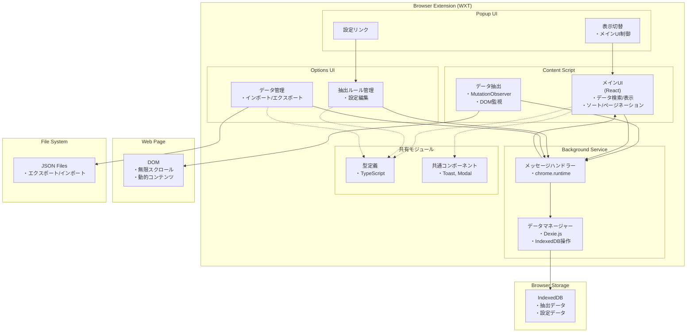
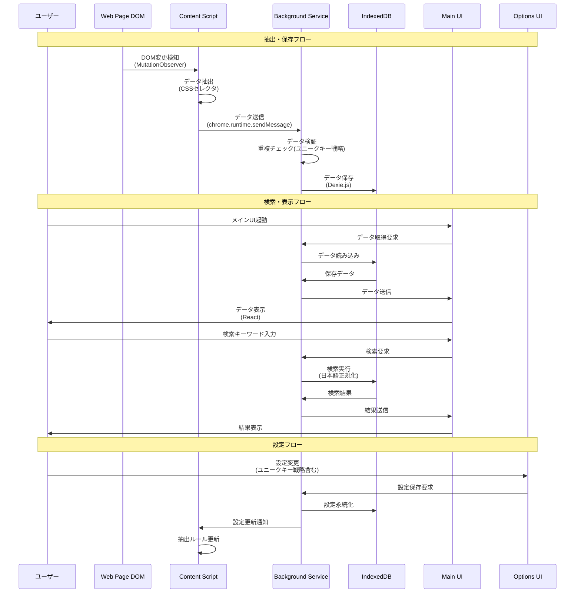
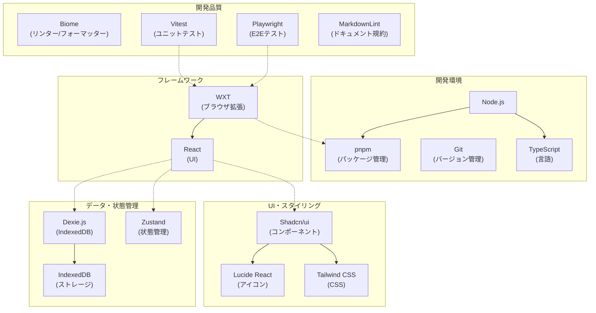
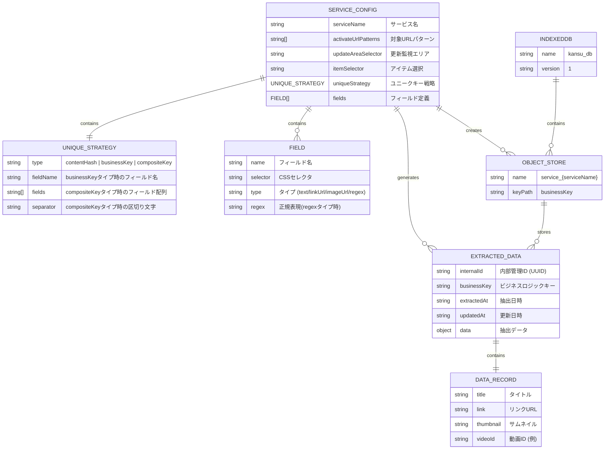

# Kansu: infinite scroll archiver 実装ガイド

## 1. 概要

本ドキュメントは、ブラウザ拡張機能「Kansu」の実装に関する技術的な仕様を定義します。

この仕様は変更される可能性があります。

## 2. 開発アーキテクチャ

### 2.1. 技術スタック

| カテゴリ                         | 技術                                                           | 目的・理由                                                                                     |
| :------------------------------- | :------------------------------------------------------------- | :--------------------------------------------------------------------------------------------- |
| **パッケージ管理**               | pnpm                                                           | 高速でディスク容量を節約でき、Plasmoで強く推奨されているため。                                 |
| **言語**                         | [TypeScript](https://www.typescriptlang.org/)                  | 静的型付けにより、開発時のエラーを早期に検出し、コードの堅牢性を向上させるため。               |
| **ブラウザ拡張フレームワーク**   | [WXT](https://wxt.dev/)                                        | Viteをベースとした高速な開発体験と、主要ブラウザへのクロスプラットフォーム対応を実現するため。 |
| **フロントエンドフレームワーク** | [React](https://react.dev/)                                    | コンポーネントベースの開発により、UIの再利用性とメンテナンス性を高めるため。                   |
| **UIコンポーネント**             | [Shadcn/ui](https://ui.shadcn.com/)                            | Radix UIをベースとし、高いカスタマイズ性と必要なコンポーネントのみを取り込めるため。           |
| **アイコンライブラリ**           | [Lucide React](https://lucide.dev/guide/packages/lucide-react) | Shadcn/uiがデフォルトで利用を想定している、シンプルで一貫性のあるアイコンセットのため。        |
| **CSSフレームワーク**            | [Tailwind CSS](https://tailwindcss.com/)                       | Shadcn/uiがこの利用を前提としているため。                                                      |
| **データストレージ**             | [Dexie.js](https://dexie.org/)                                 | IndexedDBを容易に操作し、大量の構造化データを効率的に管理するため。                            |
| **状態管理**                     | [Zustand](https://github.com/pmndrs/zustand)                   | Reduxライクな単一ストアモデルを、よりシンプルかつ軽量に提供するため。複雑な状態の管理に適している。 |
| **コード品質**                   | [Biome](https://biomejs.dev/)                                  | リンターとフォーマッターを統一されたツールで提供し、コードの一貫性を保つため。                 |
| **テストフレームワーク**         | [Vitest](https://vitest.dev/)                                  | 高速なユニットテストとコンポーネントテストを可能にし、WXTとの統合が容易なため。                |
| **E2Eテストフレームワーク**      | [Playwright](https://playwright.dev/)                          | 実際のブラウザ環境で拡張機能全体の動作をテストし、信頼性を確保するため。                 |
| **ドキュメント規約**             | [MarkdownLint](https://github.com/DavidAnson/markdownlint)     | Markdownファイルのスタイルを統一し、可読性を維持するため。                                     |

### 2.2. アーキテクチャ設計

プロジェクトのソースコードは、整理のために `src` ディレクトリ内に配置します。 ref: <https://wxt.dev/guide/essentials/project-structure.html#adding-a-src-directory>
Kansuは、WXTフレームワークが提供するファイルベースのルーティングと役割分担に基づき、以下の主要なエントリーポイントで構成されます。

- **Content Scripts**:
  - ユーザーが閲覧しているページに挿入され、**データ操作の主役**となります。主な責務は以下の通りです。
    1. **メインUIの注入と管理**: データの検索・ソート・一覧表示機能を持つリッチなUI（Reactコンポーネントで構築）をページ内に注入します。
       - ユーザーは、検索キーワード入力、検索対象カラム選択、ソート方法（昇順/降順）、ページあたりの表示件数を設定できます。
    2. **データ抽出**: `MutationObserver` を用いてDOMの変更を監視し、新しいデータを抽出します。
    3. **バックグラウンド通信**: 抽出したデータの保存依頼や、表示に必要なデータの取得要求をバックグラウンドサービスに送信します。
    - **データ表示**: バックグラウンドスクリプトから保存済みデータを取得し、UIに表示します。検索とソートはクライアントサイドでリアルタイムに実行し、日本語の正規化を行い表記揺れを吸収します。

- **Background Service**:
  - 拡張機能のバックグラウンドで動作し、中心的なデータ処理を担います。
  - Content Scriptsから受信したデータを、Dexie.jsを用いてIndexedDBに保存します。
  - オプションページやポップアップからのデータ要求に応じて、IndexedDBからデータを取得し、応答します。

- **Popup UI**:
  - 拡張機能のツールバーアイコンをクリックした際に表示されるUIです。
  - ポップアップには、現在のタブでKansuのメインUIの表示/非表示を切り替えるためのトグルスイッチと、オプションページへ遷移するためのリンクを配置します。

- **Options UI**:
  - **拡張機能全体の設定**を管理するページです。主な責務は以下の通りです。
    1. **抽出ルールの管理**: データ抽出のルール（対象URL、CSSセレクタ等）をサービスごとに設定・管理します。
    2. **グローバル設定**: アプリケーション全体の動作に関わる設定項目を提供します。
    3. **データ管理**: 全サービスにわたるデータの一括インポート/エクスポート機能を提供します。
       - **インポート/エクスポート**: IndexedDBから指定されたサービスのデータと設定を取得しJSON形式でファイルに保存、またはユーザーが選択したJSONファイルを読み込み内容を検証した上でIndexedDBに書き込みます。

- **共有モジュール**:
  - データ構造の型定義（TypeScriptの`interface`や`type`）など、複数のコンポーネントで共有されるコードを配置します。
  - **共通UIコンポーネント**: `Toast` (トースト通知), `Modal` (モーダルダイアログ) など、汎用的に利用されるUIコンポーネント。

### 2.3. データフロー

#### 抽出・保存フロー

1. **抽出**: Content Scriptがページ上のDOM変更を検知し、データを抽出します。
2. **保存依頼**: 抽出したデータをBackground Serviceへ送信します。
3. **永続化**: Background Serviceは受信したデータを検証し、Dexie.jsを介してIndexedDBに保存します。

#### 検索・表示フロー

1. **表示要求**: メインUI (Content Script) が起動時、またはユーザー操作時に、表示に必要なデータをBackground Serviceに要求します。
2. **データ取得**: Background ServiceはIndexedDBからデータを取得し、メインUIへ送信します。
3. **レンダリング**: メインUIは受信したデータをReactコンポーネントで画面に表示します。
4. **検索実行**: ユーザーが検索キーワードを入力すると、メインUIはそれをBackground Serviceに送信します。
5. **結果取得**: Background ServiceはキーワードでIndexedDBを検索し、結果をメインUIに返します。
6. **結果表示**: メインUIが検索結果で再レンダリングされます。

#### 設定フロー

1. **設定変更**: ユーザーがOptions UIで抽出ルールなどの設定を変更・保存します。
2. **設定保存**: Options UIは変更内容をBackground Serviceへ送信し、Background ServiceがそれをIndexedDBに永続化します。

### 2.4. 開発環境

- **バージョン管理**: Gitを使用し、リポジトリはGitHubで管理します。
- **ブランチ戦略**: `main`ブランチを常にデプロイ可能な状態に保ち、機能追加や修正はフィーチャーブランチを作成して行う、シンプルなGitHub Flowを採用します。
- **コミットメッセージ**: Conventional Commits ([https://www.conventionalcommits.org/](https://www.conventionalcommits.org/)) の規約に沿って記述し、変更内容の履歴を分かりやすく保ちます。

### 2.5. 視覚的システム概要

#### 2.5.1. システムアーキテクチャ図



#### 2.5.2. データフロー図



#### 2.5.3. 技術スタック構成図



#### 2.5.4. データ構造図



## 3. 機能実装詳細

### 3.1. データ抽出モジュール (Content Script)

- **トリガー**: `DOMContentLoaded` イベントと、`MutationObserver` を使用して、指定された要素 (`updateAreaSelector`) の子要素の変更を監視します。
- **データ抽出処理**:
  - `itemSelector` に合致する要素群を取得します。
  - 各要素から `fields` で定義されたルールに基づき、データを抽出します。
    - `text`: `element.innerText` を使用します。
    - `linkUrl`: `element.href` を使用します。
    - `imageUrl`: `element.src` を使用します。
    - `regex`: `String.prototype.match()` と指定された正規表現を用いて、`element.innerHTML` または `element.innerText` から文字列を抽出します。
- **データ送信**: 抽出したデータは、`chrome.runtime.sendMessage` API を介してバックグラウンドスクリプトに送信します。

### 3.2. データ管理モジュール (Background Script)

- **データ受信**: コンテンツスクリプトやオプションページからメッセージを受け取り、IndexedDBへの各種操作（保存、検索、取得）をトリガーします。
- **データベース操作**:
  - **Dexie.js** を用いて、IndexedDBへのアクセスを抽象化し、効率的なデータ操作を実現します。
  - サービスごとにオブジェクトストアを作成し、データを管理します。
  - **ユニークキー戦略**: 設定で指定された戦略に基づき、重複検出と保存を行います。
    - `contentHash`: 全フィールドの内容をハッシュ化して重複検出
    - `businessKey`: 指定されたフィールドの値をキーとして使用
    - `compositeKey`: 複数フィールドを組み合わせたキーを生成

### 3.3. ユニークキー戦略の実装

#### 3.3.1. Content Hash 戦略

```typescript
function generateContentHash(data: Record<string, any>): string {
  const sortedEntries = Object.entries(data)
    .sort(([a], [b]) => a.localeCompare(b));
  const content = sortedEntries.map(([key, value]) => `${key}:${value}`).join('|');
  return generateHash(content);
}
```

#### 3.3.2. Business Key 戦略

```typescript
function generateBusinessKey(data: Record<string, any>, fieldName: string): string {
  return data[fieldName] || generateContentHash(data); // フォールバック
}
```

#### 3.3.3. Composite Key 戦略

```typescript
function generateCompositeKey(
  data: Record<string, any>, 
  fields: string[], 
  separator: string = '|'
): string {
  const values = fields.map(field => data[field] || '');
  return values.join(separator);
}
```

## 4. データ構造

### 4.1. 設定データ (JSON)

```json
{
  "serviceName": "YouTube",
  "activateUrlPatterns": ["https://www.youtube.com/*"],
  "updateAreaSelector": "#contents",
  "itemSelector": "ytd-video-renderer",
  "uniqueStrategy": {
    "type": "businessKey",
    "fieldName": "videoId"
  },
  "fields": [
    { "name": "title", "selector": "#video-title", "type": "text" },
    { "name": "link", "selector": "#video-title", "type": "linkUrl" },
    { "name": "thumbnail", "selector": "img.style-scope", "type": "imageUrl" },
    { "name": "videoId", "selector": "#video-title", "type": "regex", "regex": "href=\"/watch\\?v=([^&\"]+)\"" }
  ]
}
```

#### 設定例: 複数戦略

**Content Hash戦略** (ニュース記事等)

```json
{
  "serviceName": "NewsWebsite",
  "uniqueStrategy": {
    "type": "contentHash"
  }
}
```

**Composite Key戦略** (日別コンテンツ等)

```json
{
  "serviceName": "DailyNews",
  "uniqueStrategy": {
    "type": "compositeKey",
    "fields": ["channelId", "publishDate"],
    "separator": "|"
  }
}
```

### 4.2. 抽出データ (IndexedDB)

- **オブジェクトストア名**: `service_{serviceName}`
- **キー**: ユニークキー戦略に基づいて生成されたビジネスキー
- **レコード**:

```json
{
  "internalId": "550e8400-e29b-41d4-a716-446655440000",
  "businessKey": "abc123",
  "extractedAt": "2024-06-29T10:00:00Z",
  "updatedAt": "2024-06-29T10:30:00Z",
  "data": {
    "title": "プログラミング講座 第1回",
    "link": "https://youtube.com/watch?v=abc123",
    "thumbnail": "https://img.youtube.com/vi/abc123/maxresdefault.jpg",
    "videoId": "abc123"
  }
}
```
